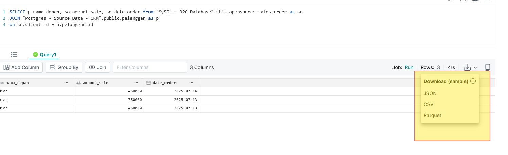

# Dremio: Bridging Data Silos

### **Table of Contents**

**1. Background: Overcoming Data Silo Problems**
**2. Dremio, The Magic Bridge Between Your Data**
**3. Connecting the Worlds**
**4. Bringing the Story Together with SQLs**
**4. Chapter III: Uniting Relational and Non-Relational Worlds**
**5. Export data**
**6. Running the Experiment with Docker Compose**


### **1. The Problem: Trapped in Data Silos**

Imagine you're a data analyst trying to create a sales report. Your data isn't in one single, convenient location. Transaction data is in **MySQL**, while customer details are stored in **PostgreSQL**. To get a full picture of "who bought what," you have to run complicated queries, switching between two different systems.

To make things even more complicated, sales activity logs from an application are stored in a **MongoDB** database, making it even harder to integrate all the information.

This is a classic problem: **data silos**. Data is scattered, isolated, and disconnected. The traditional solution is **ETL (Extract, Transform, Load)**—a time-consuming process that often leaves your data out of date. You and your team have to wait for stale data.

Then, we discovered **Dremio**.


### **2. Dremio, The Magic Bridge Between Your Data**

Dremio isn't a data warehouse or a database. It's a **data virtualization engine** that acts as a smart bridge for all your data sources. Without needing to copy or move data, Dremio creates a virtual layer that unifies everything. It allows you to query data from anywhere, as if it all resides in one place.


### **3. Connecting the Worlds**

The first step was to introduce Dremio to our data sources. We opened the Dremio interface and selected the connectors for **MySQL**, **PostgreSQL**, and **MongoDB**.


    


After entering the connection details, Dremio was successfully connected in seconds. On the left panel, we saw them all: `MySQL - B2C Database`, `Postgres - Source Data - CRM`, and `MongoDB- Data Log`. Three separate silos were now side-by-side, as if they were long-time friends.


### **4. Bringing the Story Together with SQL**

Now, for the real magic. Inside Dremio's SQL editor, we wrote a few simple queries to combine our data.

#### **4.1. Sales Data by Customer**


This query joins transaction data (`sales_order` from MySQL) with customer details (`pelanggan` from PostgreSQL) based on the customer's `id`.


```sql
SELECT p.nama_depan, so.amount_sale, so.date_order
FROM "MySQL - B2C Database".sbiz_opensource.sales_order AS so
JOIN "Postgres - Source Data - CRM".public.pelanggan AS p
ON so.client_id = p.pelanggan_id
```

With a single click of `Run`, Dremio performed its magic. It sent the command to both databases, retrieved the necessary data, and combined it in Dremio's virtual layer.


#### **4.2. Log Activity by User**


This query joins sales transaction data (`user` from MySQL) with user activity logs (`log_activity` from MongoDB) based on `username`.


```sql
SELECT l.*, u.username
FROM "MySQL - B2C Database".sbiz_opensource."user" as u
INNER JOIN "MongoDB- Data Log"."microservice-log-activity-user".log_activity_user_test as l
ON l.username = u.username
```

Once again, with a single click, Dremio brought together data from two very different worlds—a relational database and a NoSQL database—and presented a unified view.


### **5. Running the Experiment with Docker Compose**

To replicate this environment, you can use Docker Compose. This file will set up a Dremio instance along with your databases, allowing you to run the same experiment locally.

You can set up the environment with a simple command:

```bash
docker-compose up -d
```


### **5. Export Data **

Based on your description, here is the information in English.

### **Exporting Dremio Query Results**

Dremio query results can be exported to various locations and formats, depending on your needs. This allows the processed data to be used for different purposes, from reporting to machine learning.

The results can be used for:
* **Reporting:** The data is used to create dashboards and reports for business intelligence and analysis.
* **Raw data for IT Training:** The data is used as a training dataset for machine learning models or other data science applications.

---

### **Export Options and Destinations**

Dremio provides several options for exporting your query results:

1.  **Directly to BI Tools**
    This is the most common use case. You can connect Dremio directly to your favorite BI tools to create dashboards and visualizations. Dremio provides native connectors for:
    * **Tableau**
    * **Microsoft Power BI**
    * **Qlik**

    

2.  **To File Storage**
    You can save your query results as files in various formats and store them in your data lake or other file systems. The supported formats include:
    * **JSON**: Ideal for semi-structured data.
    * **CSV**: A universal format for data tables.
    * **Parquet**: An optimized columnar storage format that is highly efficient for analytical queries.

    These files can be stored in platforms like **Amazon S3, HDFS, Google Cloud Storage, or Azure Data Lake Storage**.

    

3.  **To Other Applications**
    Dremio can also be integrated with other applications through various connectors or APIs. For example, you can use the **Apache Arrow Flight** protocol to efficiently export data to applications like Python for further analysis or data science workflows.


### **6. Conclusion: The Future of Data Analytics**

This experiment proves that **Dremio** is more than just a tool; it's a revolution in how we work with data. We successfully solved the data silo problem without tedious ETL processes. Dremio turns fragmented data into a single, consistent source of truth, empowering anyone to access, combine, and analyze data in real-time.

The future of data analytics is about flexibility and speed, and Dremio is the key.